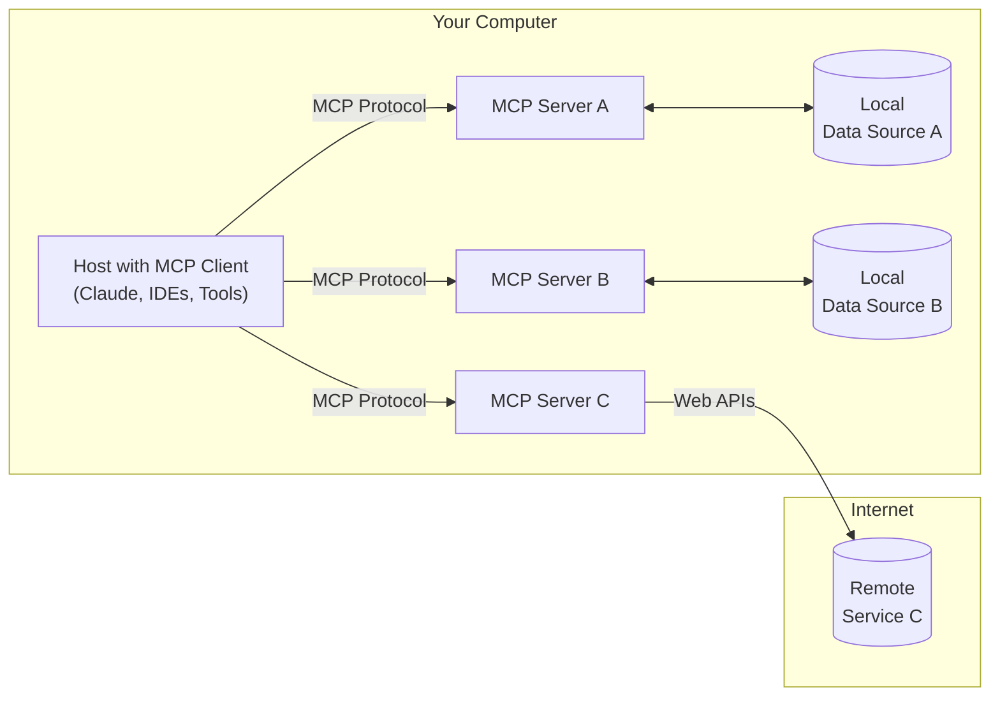

# Model Context Protocol

The Model Context Protocol is an open source protocol that standardizes how applications provide context to LLMs.




It lets us build servers that expose data and functionalaity to LLM applications. Its often described as the “a USB-C port for AI applicaitons”, providing a uniform way to connect LLMs to resources they can use.

Just as USB-C port provides a standardized way to connect your devices to various perpherials and accessoris, MCP provides a standardized way to connect to AI models to differnt data sources and tools.

It may be easier to think of it as an API, but specifically designed for LLM interactions.  MCP servers can:

  - expose data through `Resources` (think of these sort of like GET endpoints; they are used to load information into the LLM’s context)
  - provide functionality through `Tools` (sort of like POST end points; they are used to execute code)
  - We can define interaction patterns through `Prompts` (resuable templates for LLM interactions)

---

### Introductory Example

A FastMCP server is a collection of tools, resources and other MCP compoents. To create a server we start by instantiaing the `FastMCP` class.

Create a new file called `my_se rver.py` and add the following code:

``` python
from fastmcp import FastMCP

mcp = FastMCP("My MCP Server")
```

To add a tool that returns a simple greeting, write a function and decorate it with `@mcp.tool` to register it with the server:

``` python
from fastmcp import FastMCP

mcp = FastMCP("My MCP Server")

@mcp.tool
def greet(name: str) -> str:
    return f"Hello, {name}!"
```

In order to run the server with Python, we need to add a run statement to the `__main__` block of the server file.

``` python
from fastmcp import FastMCP

mcp = FastMCP("My MCP Server")

@mcp.tool
def greet(name: str) -> str:
    return f"Hello, {name}!"

if __name__ == "__main__":
    mcp.run()
```
This lets us run the server with `python my_server.py`, using the default stdio transport, which is the standard way to expose an MCP server to a client.

Now that the server can be executed with python my_server.py, we can interact with it like any other MCP server.

In a new file, create a client and point it at the server file:

``` python
import asyncio
from fastmcp import Client

client = Client("my_server.py")

async def call_tool(name: str):
    async with client:
        result = await client.call_tool("greet", {"name": name})
        print(result)

asyncio.run(call_tool("Hanan"))

```

``` bash
➜  quickstart python my_client.py 
[06/24/25 09:12:08] INFO     Starting MCP server 'My MCP server.py:1246
                             Server' with transport                    
                             'stdio'                                   
[TextContent(type='text', text='Hello, Hanan!', annotations=None)]
```


### Key Takeaways:
- We have successfully equipped your LLM with a new capability (a greeting tool.)
This demonstrates the fundamental power of MCP: **turning any function into a tool that an LLM can use.**

- The Three-Step Pattern:
    1. Define a function with clear inputs and outputs
    2. Decorate it with `@mcp.tool` to register it with the server
    3. Run the server to make it available to LLM clients

- Deterministic Function Execution: Our greeting function is a  deterministic tool - given the same input (name), it always produces the same output. This is crucial for LLM reliability.

This simple example demonstrates that MCP isn't just about connecting to external APIs. It's about making any code accessible to LLMs in a standardized way. Your greeting function could be replaced with any business logic, and the LLM would use it the same way.


---

### Motivation

Models are only as good as the context provided to them. You can have an incredibly intelligent model at the frontier, but if it doesn't have the ability to connect to the outside world and pull in necessary data and context, it's not as useful as it can possibly be.

MCP helps build agents and complex workflows on top of LLMs. LLMs frequently need to intergrate with data and tools, and MCP provides:
- Pre-buillt intergrations that our LLM/AI application can plug into
- Flexibility swtich between differnt LLM providers and AI applications
- Best practices for securing your data within your infrastructure

### General Architecture

- **MCP hosts** are IDEs or AI tools (RooCode, GitHub Co-pilot, Claude Desktop)
  - [https://modelcontextprotocol.io/clients](https://modelcontextprotocol.io/clients)
- MCP clients (protocol clients) that maintain 1:1 connection with servers
- MCP servers: Light weight programs that each expose specific capabilities through MCP
- Local data sources like your computers’s files, databases, and servinces that MCP servers can securely access
- Remote services are exteral systems availble over the internet (e.g., through APIs) that MCP servers can connect

Everything that can be done with MCP can technically be done without it. MCP doesn't reinvent the wheel for things like tool use. It just aims to standardize how AI applications interact with external systems. This is why other AI competitors to Anthropic like OpenAI and Google have adopted MCP. An analogy I would use is it's like how web applications communicate with backends and other systems using REST, where you have a specified protocol, statelessness, and so on. MCP standardizes how AI applications interact with external systems. Instead of building the same integration for different data sources over and over again depending on the model or the data source, you build once and use everywhere.

MCP shifts the burden and separates concerns cleanly. Build an MCP app and connect it to servers for whatever data you need. Want data from AWS? There's a server. Need Git access? There's a server. The goal is simple: use natural language to talk to data stores without writing all that logic.

The beauty is that these servers are reusable. An MCP server for Google Drive works with any MCP app you build. AI assistant, agent, desktop app. If it speaks MCP, it can use that server. Let your imagination run with all the data access you can bring to your application with minimal code.

**Who wins with MCP?**
- App developers: Connect with minimal code
- API developers: Build once, adopt everywhere
- Users: Just bring a URL, get your data
- Enterprises: Separate concerns, let teams build independently

## Who authors the MCP server?

You can build them yourself or use community ones. You can make a MCP server to wrap up access to some servince. Often the service provider itself will make their own MCP server implementation. We'll build our own.

## How is using MCP Server different from just calling a service’s API direclty?

You might be thinking MCP servers are just like APIs. You're not wrong. An analogy I would use is: MCP server as a gateway on top of an API. MCP servers provde tool schemas + functons. If you want to direclty call an API, you’ll be authoring those on your own (clarify using an example)

## What's the difference between MCP servers and tool/function calling?

MCP servers support tool use, but that's just one part. MCP servers provide tool plus schema + functions already defined for you. We will explore this in detail in the rest of this post.

The main takeaways for now is: Why use MCP? Because it works with minimal effort.

---

## How can you create an MCP server?

Lets take the example of a server that exposes tools. This server needs to handle two main requests from clients clients:
- listing all the tools
- executing a particular tool with these arguments

There are two ways of creating an MCP server:
- Low level implementation: in this approach, we can direclty define and handle the various types of request (`ListToolsReques`  and `CallToolRequst`). This approach allows you to customize every aspect of your sever
- High-level implementation using `FastMCP` : `FastMCP` is a high-level interface that makes building MCP servers faster and simpler. In this approach, you just focus on defining the tools are functions, and `FastMCP` handles all the protocol details

---

To create an MCP server using FastMCP, we initialize a `FastMCP` server labled `mcp` and decorating the functions with `@mcp.tools()` . `FastMCP` automatically generates the necessary schema based on type hints and docstrings

### Tools

Tools are the core building blocks that allow our LLM to interact with external systems, execute code, and access data that isn’t training data. Tools in FastMCP transform regular Python functions into capabilities that LLMs can invoke during conversations. When an LLM decides to use a tool:
1. It sends a request with parameters based on the tool’s schema.
2. FastMCP validates these parameters against your function’s signature.
3. Our function executes with the validated inputs.
4. The result is returned to the LLM, which can use it in its response.

This allows LLMs to perform tasks like querying databases, calling APIs, making calculations, or accessing files—extending their capabilities beyond what’s in their training data.

Creating a tool is as simple as decorating a Python function with `@mcp.tool`:

``` python
from fastmcp import FastMCP

mcp = FastMCP(name="CalculatorServer")

@mcp.tool
def add(a: int, b: int) -> int:
    """Adds two integer numbers together."""
    return a + b

```
When this tool is registered, FastMCP automatically:
- Uses the function name (`add`) as the tool name.
- Uses the function’s docstring (`Adds two integer numbers...`) as the tool description.
- Generates an input schema based on the function’s parameters and type annotations.
- Handles parameter validation and error reporting.


The way you define your Python function dictates how the tool appears and behaves for the LLM client.

>Functions with `*args` or `**kwargs` are not supported as tools. This restriction exists because FastMCP needs to generate a complete parameter schema for the MCP protocol, which isn’t possible with variable argument lists.


### Resources

Resources are read-only dat that an MCP server can expose to the LLM application. Resources are similar to GER endpoint request in a Rest API. They provide data but shouldn’t perfrom significant computation or have side effects. For examples, the resource can be a list of folders within a directory or the content of a file within a folder. Here, the MCP server provides

### Prompt Template

Server can also provide a prompt template. You can define this feature in the MCP server using the decorator `@mcp.prompt()` a g
