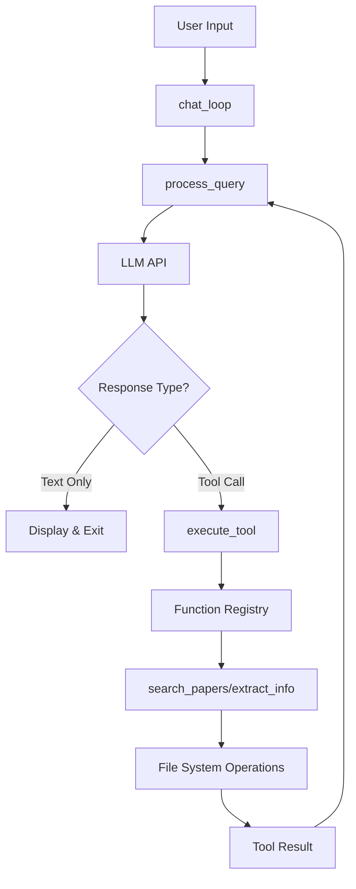

# arXiv Paper Search Agent: Technical Implementation

This system implements a function-calling agent that interfaces with arXiv's API to search and retrieve academic papers. The architecture demonstrates fundamental patterns in LLM tool integration, specifically how to bridge Python functions with language model capabilities through the Model Context Protocol (MCP).

## Core Design Decision

Store papers as JSON files in a hierarchical directory structure rather than a database. This choice optimizes for simplicity and human readability - each topic gets its own directory, making manual inspection straightforward. The trade-off is query performance at scale, but for typical research workflows this is acceptable.

```
papers/
├── neural_networks/
│   └── papers_info.json
├── machine_learning/
│   └── papers_info.json
└── quantum_computing/
    └── papers_info.json
```

The `search_papers` function creates this structure dynamically. When searching for "Neural Networks", it normalizes the topic to `neural_networks` (lowercase, underscores for spaces) to ensure valid directory names. The function is idempotent - multiple calls with the same topic append new papers to the existing JSON file rather than overwriting.

```python
def search_papers(topic: str, max_results: int = 5) -> List[str]:
    client = arxiv.Client()  # Not a persistent connection - just an API wrapper
    
    # Normalize topic for filesystem: "Neural Networks" → "neural_networks"
    path = os.path.join(PAPER_DIR, topic.lower().replace(" ", "_"))
    os.makedirs(path, exist_ok=True)  # exist_ok prevents FileExistsError on repeated calls
```

The arxiv.Client() instantiation is lightweight - it's not maintaining a connection but rather creating an object that knows how to make HTTP requests to arXiv's API. Think of it as initializing a requests session with arXiv-specific configuration.

## Error Handling Pattern

The function implements defensive programming by attempting to load existing data, falling back to an empty dictionary if the file doesn't exist or contains invalid JSON:

```python
try:
    with open(file_path, "r") as json_file:
        papers_info = json.load(json_file)
except (FileNotFoundError, json.JSONDecodeError):
    papers_info = {}
```

This pattern ensures the function never crashes due to missing or corrupted data files. The append-only design means we accumulate papers over time - useful for building a personal research database.

## Linear Search Implementation

The `extract_info` function implements a linear search across all topic directories. While O(n) in the number of topics, this is acceptable because:

1. Topics are limited (typically dozens, not thousands)
2. File I/O dominates performance anyway
3. The alternative (maintaining a global index) adds complexity

```python
def extract_info(paper_id: str) -> str:
    for topic_dir in os.listdir(PAPER_DIR):  # Better name than 'item'
        topic_path = os.path.join(PAPER_DIR, topic_dir)
        if os.path.isdir(topic_path):
            json_file_path = os.path.join(topic_path, "papers_info.json")
            # ... load and search
```

## Function Registry Pattern

The `mapping_tool_function` dictionary implements dynamic dispatch - a common pattern in plugin architectures and RPC systems:

```python
mapping_tool_function = {
    "search_papers": search_papers,
    "extract_info": extract_info
}

def execute_tool(tool_name, tool_args):
    result = mapping_tool_function[tool_name](**tool_args)
```

This design enables adding new tools without modifying the dispatch logic. The `**tool_args` syntax unpacks the dictionary into keyword arguments, so `{"topic": "AI", "max_results": 10}` becomes `search_papers(topic="AI", max_results=10)`.

## String Conversion for LLM Compatibility

Language models operate on text, not Python objects. The execute_tool function normalizes all return types to strings:

```python
if isinstance(result, list):
    result = ', '.join(result)  # ['id1', 'id2'] → "id1, id2"
elif isinstance(result, dict):
    result = json.dumps(result, indent=2)  # Pretty-printed JSON
```

This ensures the LLM receives parseable text regardless of what the underlying function returns.

## The Agent Loop

The `process_query` function implements the core agent pattern - a while loop that alternates between LLM reasoning and tool execution:

```python
def process_query(query):
    messages = [{'role': 'user', 'content': query}]
    response = client.messages.create(model='claude-3-5-sonnet-20241022', 
                                    tools=tools, messages=messages)
    
    continue_processing = True  # Better name than shadowing function name
    while continue_processing:
        for content in response.content:
            if content.type == 'text':
                print(content.text)
                if len(response.content) == 1:
                    continue_processing = False
            
            elif content.type == 'tool_use':
                # Execute tool and append result to conversation
                result = execute_tool(content.name, content.input)
                messages.append({"role": "user", 
                                "content": [{"type": "tool_result",
                                           "tool_use_id": content.id,
                                           "content": result}]})
                # Get next response from model
                response = client.messages.create(...)
```

This implements the fundamental insight: **agents are while loops with function calls**. The loop continues until the model produces a text-only response (no tool calls), indicating it has completed the task.

## Message Protocol

The conversation follows a specific format for tool results:

```python
{
    "role": "user",
    "content": [{
        "type": "tool_result",
        "tool_use_id": "unique-id-from-model",
        "content": "string-result-from-tool"
    }]
}
```

This format tells the model "here's what your tool call returned, continue processing". The model maintains conversation state through the messages array - each append adds to the context.

## System Architecture



## Error Propagation

The system implements graceful degradation at each layer:

- File operations: Continue searching other directories if one fails
- Tool execution: Catch exceptions and return error messages
- Chat loop: Display errors without crashing the interface

```python
def chat_loop():
    while True:
        try:
            query = input("\nQuery: ").strip()
            if query.lower() == 'quit':
                break
            process_query(query)
        except Exception as e:
            print(f"\nError: {str(e)}")  # Show error but continue
```

## Performance Considerations

- JSON files are loaded entirely into memory - fine for hundreds of papers per topic
- No caching between queries - each search reloads files
- Synchronous I/O throughout - could benefit from async for multiple searches

## Security Notes

The system trusts user input for file paths (via topic names) which could enable directory traversal attacks in a production environment. The `.lower().replace(" ", "_")` normalization provides some protection but isn't comprehensive.

## Tool Definition Schema

The tools are defined using a schema that the LLM understands:

```python
tools = [
    {
        "name": "search_papers",
        "description": "Search for papers on arXiv based on a topic and store their information.",
        "input_schema": {
            "type": "object",
            "properties": {
                "topic": {
                    "type": "string",
                    "description": "The topic to search for"
                }, 
                "max_results": {
                    "type": "integer",
                    "description": "Maximum number of results to retrieve",
                    "default": 5
                }
            },
            "required": ["topic"]
        }
    }
]
```

This schema enables the LLM to understand what tools are available and how to call them correctly.

## Key Insights

1. **Agents are fundamentally while loops** - The core pattern is a loop that alternates between LLM thinking and tool execution until the task is complete.

2. **Message history is conversation state** - The `messages` array maintains context across multiple tool calls, allowing the LLM to build on previous results.

3. **String normalization bridges worlds** - Converting Python objects to strings enables seamless communication between deterministic functions and probabilistic language models.

4. **Function registries enable extensibility** - The dictionary mapping pattern makes it trivial to add new tools without modifying core logic.

5. **Error handling must be defensive** - Each layer handles failures gracefully to prevent cascading crashes.

This implementation demonstrates core patterns in LLM tool integration. These patterns appear across frameworks like LangChain, LlamaIndex, and Pydantic AI - understanding this implementation provides insight into how those abstractions work internally. The simplicity of the core loop belies the sophistication of what's possible when you give language models access to custom functions.